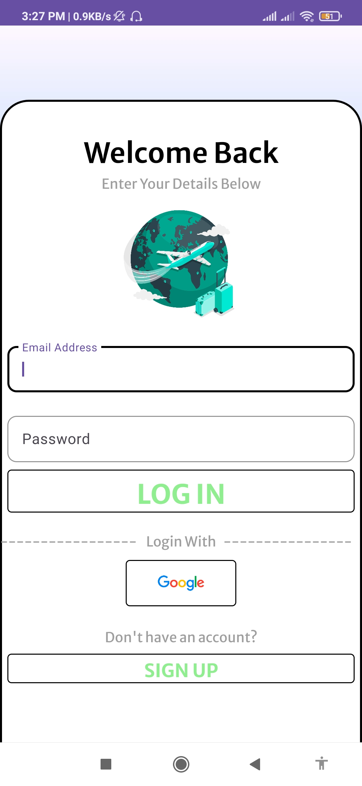
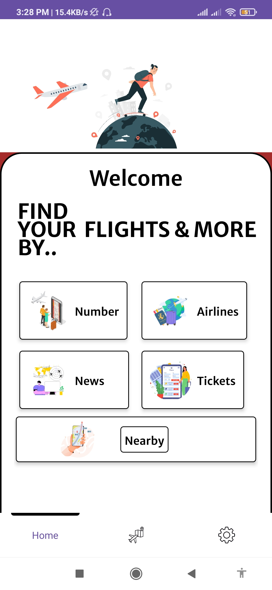
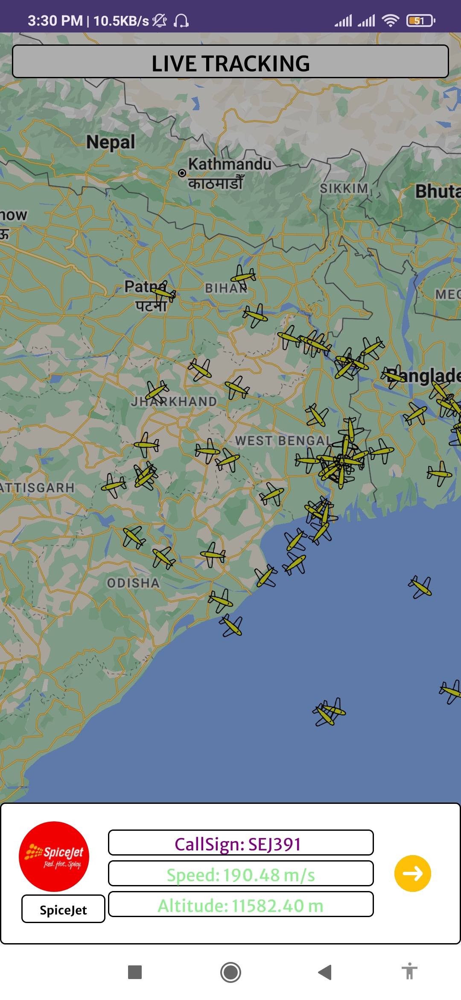
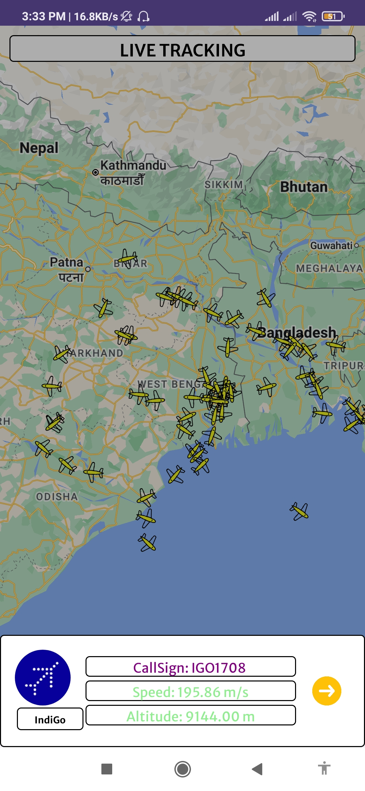
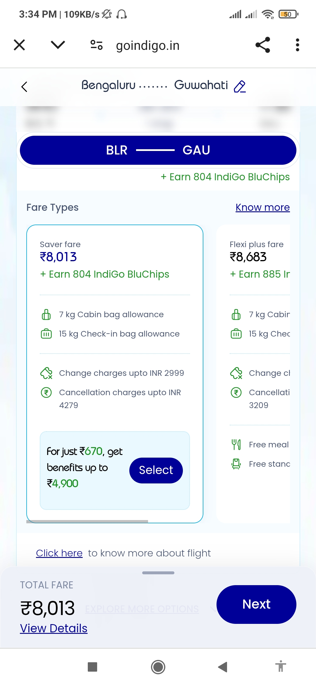
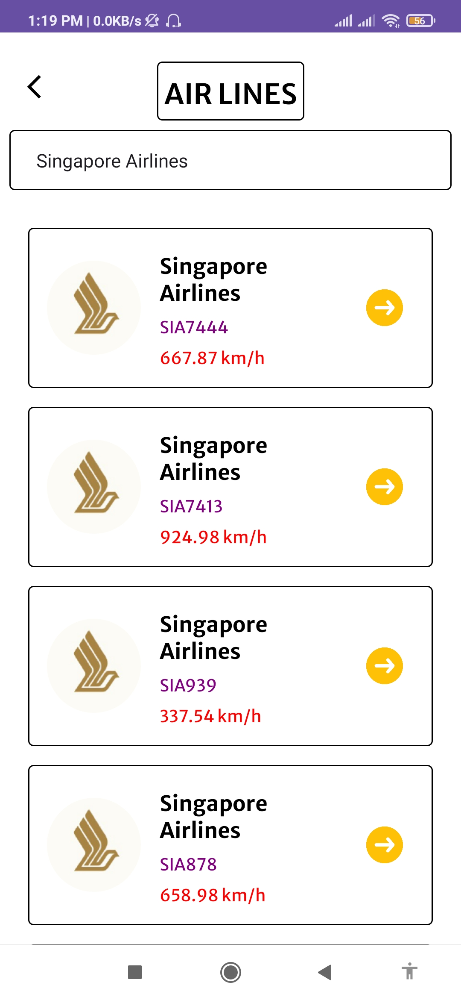

# ✈️ **Flight Tracker App**

**An innovative and cutting-edge Android Flight Tracker App** designed to provide users with **real-time flight tracking**, personalized **aviation-related content**, and an immersive travel experience. 🌍✈️ With the integration of **Google Maps** and dynamic **live flight data**, this app stands out by offering a seamless and highly interactive experience for **aviation enthusiasts** and **frequent travelers** alike. 🛫📲

## ✨ **Key Features**

### 📡 **Real-Time Flight Tracking**
- View live flights on an interactive **Google Map** in real-time. 🌍🛫
- Access **detailed flight information** including status updates, actual aircraft images, and precise **arrival/departure times** fetched dynamically from various APIs. 🛬🛫
- Get personalized updates on flight routes, delays, and more. 🚀

### 💸 **Cheap Tickets Finder**
- Discover **cheaper flight tickets** available on selected routes. ✈️💰
- **Seamless booking experience** with redirection to the airline's official website using **ChromeTabs** for smooth, secure transactions. 💻🔗

### 📰 **Latest Aviation News**
- Stay ahead with **up-to-date aviation news** directly within the app, ensuring you’re always in the loop about the latest happenings in the skies. 📲📰

### 🔍 **Flight Search by Number**
- Easily search and track any flight by its flight number and receive **real-time updates**. 🛫🔍

### ✈️ **Airline Filter**
- **Filter flights by airlines** and explore specific aircraft currently flying in the sky under that airline. ✈️🎯
- Users can **search for any airline** and get a detailed list of all the **aircraft** currently in the air from that airline, offering an exciting feature for aviation enthusiasts who love exploring different airlines and their fleet. 🛫🔍
- **Real-time data** ensures the list of aircraft is up-to-date, showcasing flights in real-time and their flight status, such as active flights, estimated times, and more. 🌐🛬

### 🌐 **Nearby Flights**
- Discover flights **currently flying near you**, providing a localized and dynamic flight-tracking experience. 🚀📍

---

## 🛠️ **Tech Stack**

### 📱 **Android Development**
- Built using **Kotlin**, **XML**, and **Jetpack Compose** for a highly dynamic and responsive UI.

### 🌐 **Backend & APIs**
- Seamless integration with **4 different APIs** to fetch live flight data, ensuring real-time information is always at your fingertips. 🌍🚀
- **Custom backend server** built with **Node.js**, **Express.js**, and **MongoDB** for user authentication and data management. 🔐💻
- Strong authentication secured using **JWT tokens**, with the backend deployed on **Heroku** for optimal scalability. ☁️

### 🎨 **UI/UX Design**
- **Custom-designed UI components** created using **Canva** to deliver an aesthetically polished, modern, and user-friendly experience. ✨🎨

### ⚡ **Asynchronous Programming**
- Leveraged **Kotlin Coroutines** for efficient background processing, ensuring smooth and responsive UI:
  - **IO Dispatcher** for API calls and network tasks. 🔄🌐
  - **Main Dispatcher** for UI updates without blocking the main thread. 🖥️💨

### 🏛️ **Architectural Pattern**
- Built using **MVVM (Model-View-ViewModel)** architecture, ensuring clear separation of concerns for better maintainability and scalability. 🧑‍💻🔍

---

## 📸 **Screenshots**

| 🔑 Login              | 🏠 Home Screen       | 🌍 Live Tracking Map |
|----------------------|---------------------|----------------------|
|    |  |  |

| 🗺️ Map               | 🗺️ Map 2             | 🛫 Flight Information |
|----------------------|----------------------|----------------------|
|        |     |  |

| 💸 Flight Ticket Search | 🖥️ ChromeTab       | 📰 Aviation News       |
|------------------------|--------------------|-----------------------|
|  |  |  |

| ✈️ Flight Search     | ✈️ Flight Search    | ✈️ Airline All Flights    |
|----------------------|----------------------|-----------------------|
|  |  |  |

---

## 🚀 **Future Enhancements**
- **Push Notifications** for live flight status updates to ensure users never miss an important flight detail. 📲✈️
- **Dependency Injection** with **Dagger Hilt** will be implemented for better modularity and easier code maintenance. 🛠️

---

## 🚀 Download the App

You can download the latest version of the **Flight Tracker App** from the link below:

[Download the app](https://drive.google.com/file/d/1wvr1DP262PnzNjUd1bFq0yH2l3gmIhVv/view?usp=drive_link)

## 📬 **Contact**
For any queries, feedback, or collaboration opportunities, feel free to reach out:

- 📧 **Email:** [rdass8794@gmail.com](mailto:rdass8794@gmail.com)

## 📝 License & Copyright

© 2025 Rahul Das. All rights reserved.

For permissions or inquiries, please contact: **rdass8794@gmail.com**

---

### ✨ Summary
- This app combines **real-time flight tracking** with **aviation-related content**, offering users a one-stop solution for their travel and aviation needs. 
- **Seamless integration with Google Maps** and **flight tracking** provides a truly immersive experience.
- With advanced features like **Nearby Flights** and **Cheap Tickets Finder**, this app is designed not just for travel, but for aviation enthusiasts who want to keep track of flights and stay updated on aviation news.

- **Crafted with precision, passion, and exceptional workmanship.** 🛠️✨
