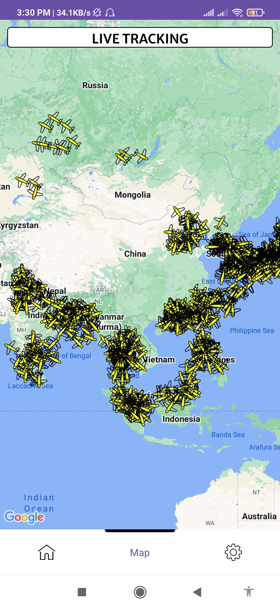
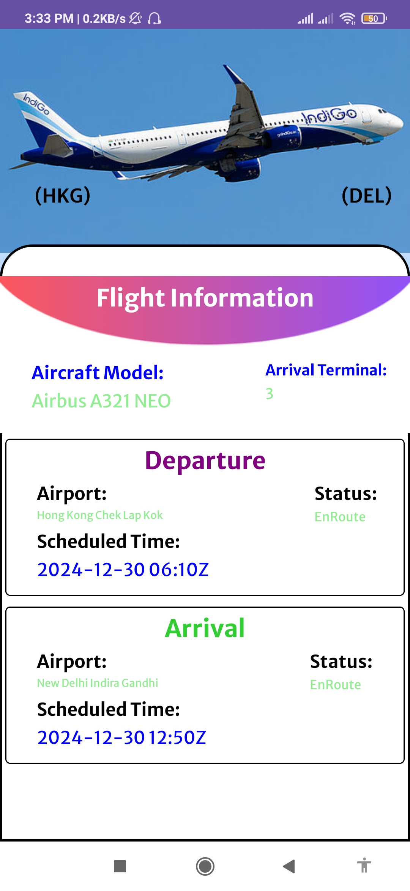
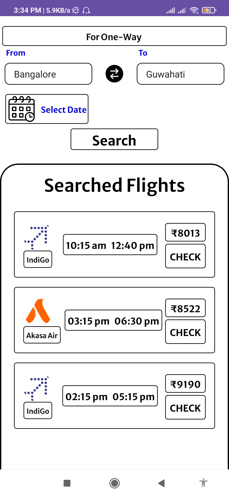
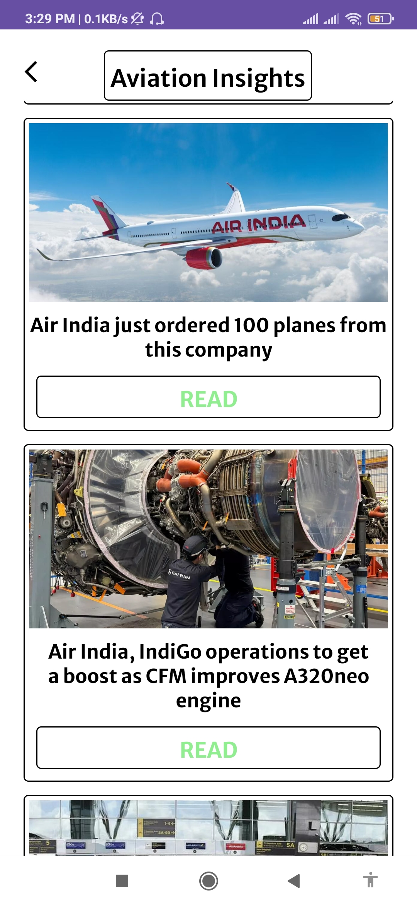
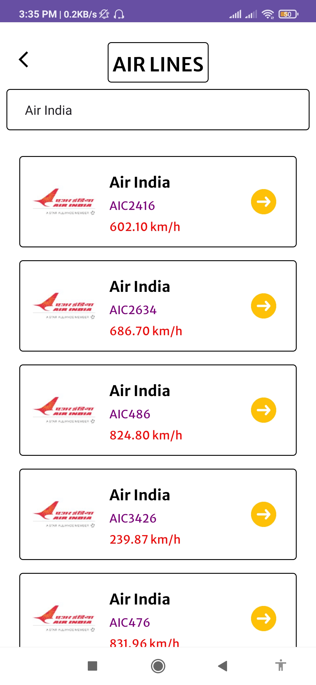

# ✈️ Flight Tracker App

An innovative Android Flight Tracker App designed to provide users with real-time flight tracking and aviation-related content. The app utilizes **Google Maps** to display live flight data, offering a seamless and interactive experience for aviation enthusiasts and travelers alike. 🌍✈️

## ✨ Key Features

### 📡 Flight Tracking
- View live flights on an interactive Google Map. 🌍🛫
- Access detailed flight information, including flight status, arrival/departure times, and actual aircraft images fetched from the web. 🛬🛫

### 💸 Cheap Tickets Finder
- Discover cheaper flight tickets available on a selected route. ✈️💰
- Redirects users to the airline's website using **ChromeTabs** for smooth and secure booking. 💻🔗

### 📰 Aviation News
- Stay informed with the latest aviation-related news directly within the app. 📲📰

### 🔍 Flight Search by Number
- Search and track any flight by its flight number to receive real-time updates. 🛫🔍

### ✈️ Airline Filter
- Filter flights by airline to explore specific aircraft, catering to aviation enthusiasts. ✈️🎯

### 🌐 Nearby Flights
- Discover flights currently flying in your vicinity, providing a localized flight-tracking experience. 🚀📍

## 🛠️ Tech Stack

### 📱 Android Development
- **Kotlin**, **XML**, and **Jetpack Compose** (for specific UI components)

### 🌐 Backend & APIs
- Integration with 4 different APIs to fetch real-time flight data. 🌍🚀
- Custom backend server built with **Node.js**, **Express.js**, and **MongoDB** for authentication. 🔐💻
- Authentication secured using **JWT tokens**, and the server is deployed on **Heroku**. ☁️

### 🎨 UI/UX Design
- Custom UI components designed using **Canva** for a polished user interface. ✨🎨

### ⚡ Asynchronous Programming
- Used **Kotlin Coroutines** for efficient background processing:
  - **IO Dispatcher** for API calls and network tasks. 🔄🌐
  - **Main Dispatcher** for updating UI smoothly without blocking the main thread. 🖥️💨

### 🏛️ Architectural Pattern
- Followed the **MVVM (Model-View-ViewModel)** architecture for clear separation of concerns and easier scalability. 🧑‍💻🔍

## 📸 Screenshots

| 🔑 Login              | 🏠 Home Screen       | 🌍 Live Tracking Map |
|----------------------|---------------------|----------------------|
|    |  |  |

| 🗺️ Map               | 🗺️ Map 2             | 🛫 Flight Information |
|----------------------|----------------------|----------------------|
|        |     |  |

| 💸 Flight Ticket Search | 🖥️ ChromeTab       | 📰 Aviation News       |
|------------------------|--------------------|-----------------------|
|  |  |  |

| ✈️ Airline Search     |
|----------------------|
|   |

## 🚀 Future Enhancements
- 🛎️ **Push notifications** for live flight status updates will be implemented. 📲✈️
- 🔧 **Implementation of Dependency Injection** using **Dagger Hilt** will be done for a modular and maintainable codebase. 🛠️

## 📬 Contact
For any queries or feedback, feel free to connect:

- 📧 **Email:** rdass8794@gmail.com

---

**Crafted with precision and exceptional workmanship.** 🛠️✨
